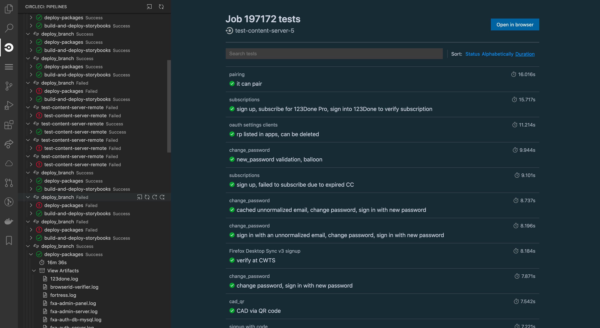

# CircleCI for VS Code

A simple extension for VS Code to allow you to monitor, manage, and inspect your Pipelines on [CircleCI](https://circleci.com).

⚠️ This project is still in beta. It uses CircleCI's [V2 API](https://circleci.com/docs/api/v2/), which includes endpoints that are still evolving, and as such may result in this extension breaking. I'll do my best to keep it updated, but it will remain in beta until those endpoints are finalized. You can [report issues here](https://github.com/jodyheavener/circleci-vscode/issues).

## How to Use

💻 You have two options for installation:

- From the [Visual Studio Marketplace](https://marketplace.visualstudio.com/items?itemName=jodyh.circleci-vscode). Just search for "CircleCI" from the Marketplace extension.
- Manually from the [Releases](https://github.com/jodyheavener/circleci-vscode/releases) page. Download the latest release of the `.vsix` file. In VS Code you can open the command palette, type "vsix", choose "Extensions: Install from VSIX...", and select the downloaded file.

📝 Either `./circle.yaml` _or_ `.circleci/config.yaml` must exist in your workspace.

🔑 An API Token is required. It can be created from your [Personal API Tokens page](https://app.circleci.com/settings/user/tokens). Open settings and search for "CircleCI" (specifically `circleci.apiToken`) and fill in your token.

⚙️ Beyond the API Token you can also configure:

- "VCS Provider" allows you to choose the version control system that your repository uses. This can be GitHub or Bitbucket.
- "Custom Branches" will, for each one, load Workflows from that branch in addition to the branch you're currently one. This can allow you to be on a feature branch but also monitor your default branch (e.g. `main`).
- "Auto Load Workflows" and "Auto Load Workflow Jobs" are safeguard options that you can use to stop the extension from automatically performing API requests for each Job from each Workflow. Don't want you to get rate-limited, after all.
- "Pipeline Reload Interval" determines how frequently, in seconds, the extension should poll CircleCI for updates to a Pipeline. Set to `0` to disable.
- "Workflow Reload Interval" determines how frequently, in seconds, we should poll CircleCI for an update to an active Workflow (one that is actively running). Set to `0` to disable.

✅ You're all set. When you open VS Code the extension will open in the background and use the Git information from your Workspace's first/main folder to look for a CircleCI Project and the branch with which to query Pipeline Workflows.

### ✨ Features

The main functionality of this extension is a Tree View containing CircleCI Project activity. From this tree you can watch your Pipeline Workflows as they complete Jobs, and from individual Jobs you can explore details like status and duration, as well as their Artifacts and Tests. Across all these objects you can trigger certain events, open them in your browser, and copy information. To learn more about what all these terms mean, check out the [CircleCI Glossary](https://circleci.com/docs/2.0/pipelines/).

#### Project View

The Project View is just the container for the tree. Along the top right you will see that you can:

- **Open in browser.** This will open the Project in your default web browser.
- **Reload details.** This will reload everything in the Project View.

#### Pipelines

Pipelines are the top level tree item, and they contain all your Workflows. Hovering over a Pipeline allows you to:

- **Open in browser.** This will open the branch-specific Pipeline in your default web browser.
- **Reload details.** This will reload the Pipeline and everything below it.

#### Workflows

Workflows are nested under each Pipeline and contain Jobs. Hovering over a Workflow allows you to:

- **Open in browser.** This will open the Workflow in your default web browser.
- **Reload details.** This will reload the Workflow and everything below it. This does not re-trigger the Workflow.
- **Retry all Jobs.** This will retry all Jobs belonging to the Workflow.
- **Retry failed Jobs.** Only visible if the Workflow is in a failed state. This will retry only failed Jobs belong to the Workflow.
- **Cancel Workflow.** Only visible if the Workflow is in a running state. This will cancel all active Jobs belonging to the Workflow.

Right-clicking on a Workflow allows you to:

- **Copy Workflow ID.** Will copy the Workflow's ID to your clipboard.

#### Jobs

Jobs exist under Workflows. Hovering over a Job allows you to:

- **Open in browser.** This will open the Job in your default web browser.
- **Reload details.** This will reload the Job and everything below it. This does not re-trigger the Job.
- **Cancel Job.** Only visible if the Job is in a running state. This will cancel the individual Job.
- **Approve Job.** Only visible if the Job is an [Approval Job](https://circleci.com/docs/2.0/sample-config/#approval-job). This will mark the Job as approved and reload the Workflow.

Right-clicking on a Job allows you to:

- **Copy Job ID.** Will copy the Job's ID to your clipboard.
- **Copy Job number.** Only visible if the Job is not an Approval Job, which has no number. Will copy the Job's number to your clipboard.

Within a Job you can:

- View its **Duration** in seconds.
- Click "**Look up Artifacts**" to load any Artifacts created by the Job. Clicking on an individual Artifact will attempt to open it. If it's a text-based file it will be opened in VS Code; if it's a binary file, such as an image, it will open in your default app for the file type.
- Click "**View Tests**" to open a webview containing the Test metadata produced by your Job, if it is available.

#### Viewing Test Results

If your Job is configured to [collect Test metadata](https://circleci.com/docs/2.0/collect-test-data/) you can open them right in VS Code. From within a Job tree item click "**View Tests**" and they'll open inside a webview. From this webview you can:

- View each Test, including its programmatic location, name, and failure details. Where possible, paths within the failure details output will link back to source files.
- Sort them by status (success, failed), alphabetically, or the length of time each one took.
- Search through all Tests by name, description, or status.
- Open the Job in your browser.

### 🤔 Troubleshooting

If you encounter problems that are not answered below please [file an issue](https://github.com/jodyheavener/circleci-vscode/issues). It would be helpful if you included output from the `Debug Console`.

Q: I see the error message: "A CircleCI API token (`circleci.apiToken`) must be set."
A: First retrieve an API token from your [Personal API Tokens page](https://app.circleci.com/settings/user/tokens). Then head to Settings, search for "CircleCI API Token", and paste it in that text field.

Q: I see the error message: "Could not retrieve Git info. Is the "origin" remote set?"
A: This could be due to a number of things:
  - If this is a new project ensure that there is an active Git instance (e.g. `git init`).
  - Is the `origin` remote set? This extension relies on the correct name of the origin remote, and not a local directory name, to query against CircleCI.
  - If you recently renamed your repository, ensure the remote is up to date. GitHub handily forwards recently changed remotes, but the extension needs it to be up to date.

Q: I see the error: "Could not retrieve Git branch."
A: Check to ensure you're on a fully qualified branch, and not a rebase commit, detached HEAD, or other funky Git state. The extension check for the non-ambiguous name of the ref.

Q: I see the error message: "There was an issue loading Pipeline/Workflow/Job/etc..."
A: An error occurred during an API request. These are a little hard to debug, but you should ensure that your API token is valid.

## Development

This extension is built with Node (yarn), TypeScript, [vsce](https://github.com/microsoft/vscode-vsce), the [VS Code Extension API](https://code.visualstudio.com/api), and the [CircleCI V2 API](https://www.npmjs.com/package/circle-client). Development is pretty straightforward:

- Clone the [project](https://github.com/jodyheavener/circleci-vscode).
- Install dependencies: `yarn install`.
- Build and watch for changes: `yarn watch`
- Run the extension locally by pressing <kbd>F5</kbd> or triggering `Start Debugging` from the command palette.
- Use the on-screen debugging tools to restart and stop debugging
- If debugging webviews, trigger `Open Webview Developer Tools` from the command palette.

When you're ready to package for distribution run `vsce package`. Don't forget to version bump.

## License and more...

- This extension is provided under the [MIT](./LICENSE) License
- While I certainly hope they like it, **this extension is not built or endorsed by CircleCI.**
- By using this extension you agree not to come after me if something goes wrong and it accidentally burns through all your CircleCI credits.
- Shout out to Eric Amodio (whose [GitLens](https://github.com/eamodio/vscode-gitlens) extension provided great reference), Paul Johnston, and others in the [VS Code Dev Slack](https://aka.ms/vscode-dev-community).
